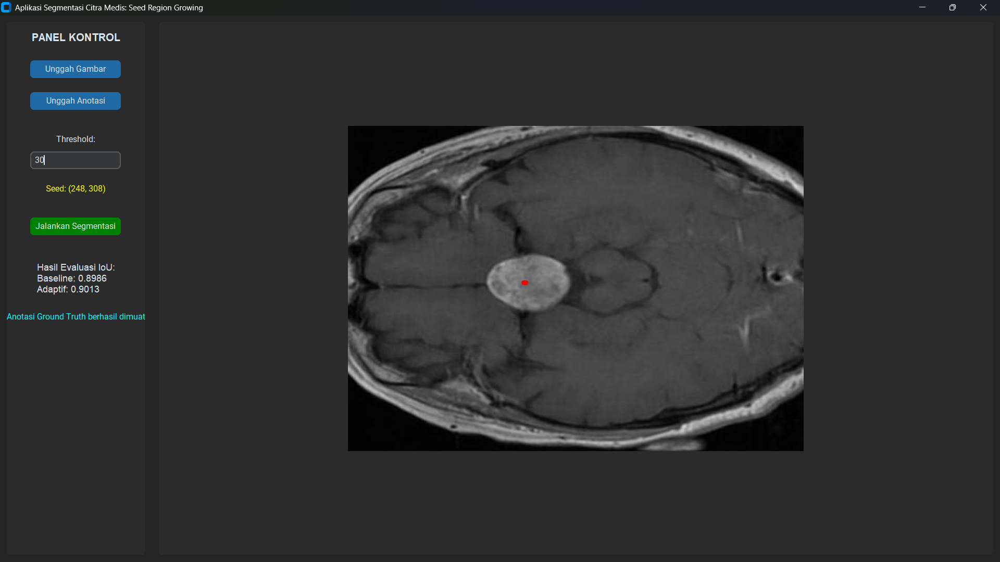
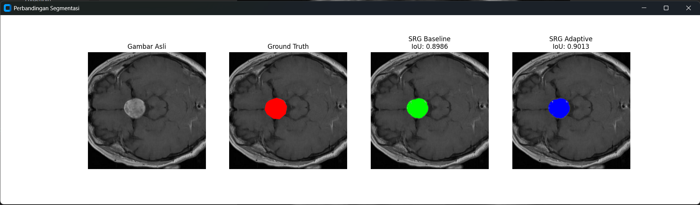

# Aplikasi Segmentasi Citra Medis: Seed Growing Region

Proyek ini adalah aplikasi desktop berbasis GUI yang dirancang untuk melakukan segmentasi citra medis menggunakan algoritma **Seed Region Growing (SRG)**. Aplikasi ini membandingkan efektivitas metode konvensional dengan metode adaptif dalam mengekstraksi area target (misalnya, tumor).

## 📝 Deskripsi Proyek
Segmentasi citra medis merupakan tahap krusial untuk memisahkan objek penting seperti tumor dari latar belakang jaringan sehat. Proyek ini mengimplementasikan dua variasi SRG untuk membantu analisis perbandingan akurasi menggunakan metrik **IoU (Intersection over Union)**.

## ⚙️ Algoritma Segmentasi

### 1. SRG Baseline (Seed-Based)
Algoritma ini menggunakan kriteria homogenitas yang statis berdasarkan nilai intensitas titik awal (*seed point*).
- **Kriteria**: $|I(x,y) - I(seed)| \le T$
- **Karakteristik**: Cenderung menghasilkan area yang sangat luas (*over-segmentation*) jika tekstur tumor tidak seragam.

### 2. SRG Adaptive (Mean-Based)
Variasi ini menggunakan nilai rata-rata (*mean*) wilayah yang diperbarui secara dinamis setiap kali piksel baru ditambahkan.
- **Kriteria**: $|I(x,y) - \mu_{region}| \le T$
- **Karakteristik**: Lebih fokus, batas segmentasi lebih jelas, dan lebih adaptif terhadap variasi intensitas lokal pada citra MRI.

## 🚀 Cara Penggunaan
1. **Upload Gambar**: Pilih citra MRI (8-bit grayscale).
2. **Upload Anotasi**: Pilih file `.txt` berisi koordinat Ground Truth (format YOLO/Polygon).
3. **Konfigurasi**: Tentukan nilai *Threshold* (contoh: 15 atua 30).
4. **Pilih Seed**: Klik pada bagian tumor di gambar untuk menentukan titik awal (ditandai titik merah).
5. **Proses**: Klik **Jalankan Segmentasi** untuk melihat perbandingan 4 panel dan skor IoU.

## 📸 Screenshot Aplikasi
Berikut adalah tampilan perbandingan hasil segmentasi:

## 📊 Sumber Data
Dataset medis yang digunakan bersumber dari:  
**[Kaggle: Medical Image Dataset Brain Tumor Detection](https://www.kaggle.com/datasets/pkdarabi/medical-image-dataset-brain-tumor-detection)**

## 📂 Struktur File
- `main.py`: Kode utama aplikasi GUI dan algoritma.
- `requirements.txt`: Daftar dependensi library.
- `assets/`: Folder penyimpanan gambar dokumentasi.

## 📜 Lisensi
Proyek ini dilisensikan di bawah **MIT License**.